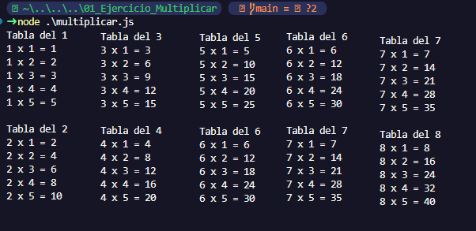
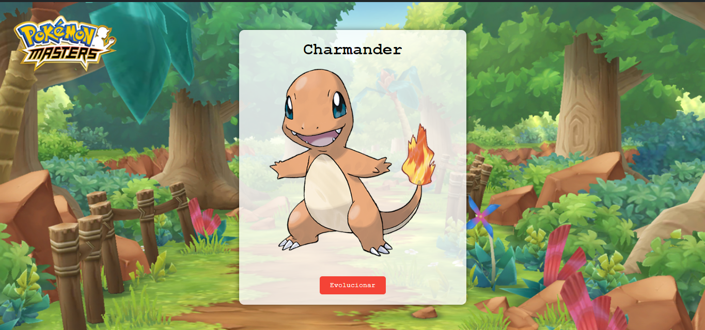
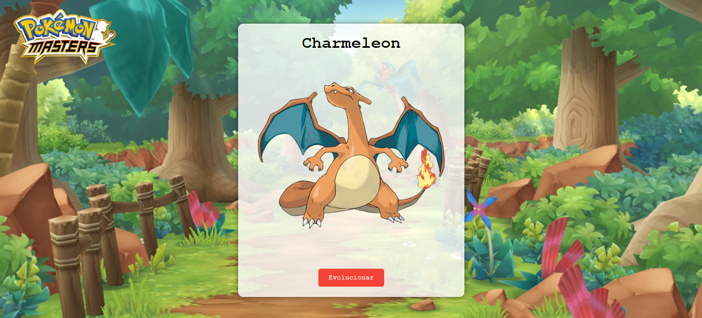
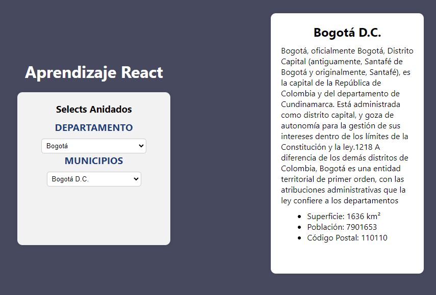
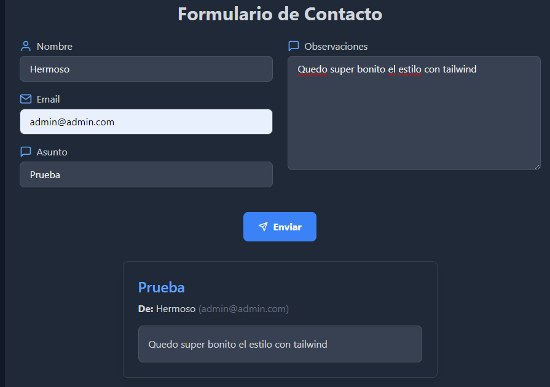

## Ejercicios Mujeres Digitáles Grupo 2

- [Ejercicio 01 Tablas de multiplicar](01_Ejercicio_Multiplicar/multiplicar.js)
    
    Tablas de multiplicar con js vanilla

    

-  [Ejercicio 02 DOM](02_DOM)

    Modificación del DOM de html con js, lo hice con la evolución de un Pokemón

    

    

-  [Ejercicio 03 Hooks en React](03_React_Semana_2)

    Por medio de useState() y useEffect() se practicaron peticiones a un api de ciudades y departamentos de Colombia, y con la información de esta se realizan select anidados que reaccione uno al cambio de otro.

    

-  [Ejercicio 04 Formularios en React](04_05_React_Forms_Tailwind)

    Se construyen formularios con validación de errores de forma manual y también con librerias.

    

-  [Ejercicio 05 Estilización con Tailwind](04_05_React_Forms_Tailwind)

    Usar las diferentes clases y customatización de Tailwind en React, lo apliqe al proyecto de forms

    

-  [Ejercicio 06 React Router DOM](06_ReactRouter_Grupo_A)

    En grupo se realizo un mini-proyecto para hacer uso de todas las funcionalidades de ReactRouterDOM

    